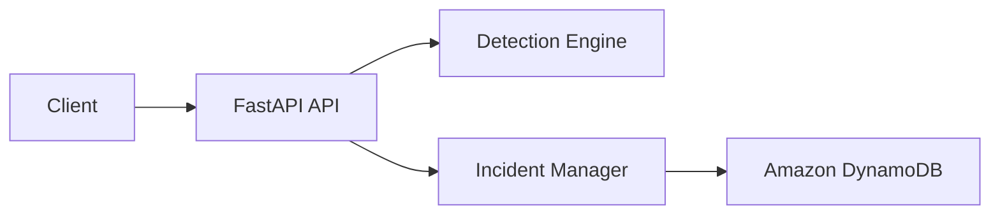

# CloudGuard Threat Detection

> Cloud-Native Threat Detection & Incident Management API


CloudGuard Threat Detection is a cloud-native threat detection and incident management API designed to process security events, evaluate detection rules, generate risk-scored incidents, and track incident lifecycle states through a REST interface.

The platform analyzes incoming events, classifies threats based on predefined detection logic, assigns severity and priority levels, and creates incident records that can be investigated, acknowledged, and resolved through dedicated workflow endpoints.

Built with FastAPI, Amazon DynamoDB, and Docker, the project demonstrates how modern cloud-native technologies can be combined to implement event-driven threat analysis, incident persistence, operational reporting, filtering capabilities, and lifecycle management within a security-focused environment.

## Key Features

- Rule-based threat detection
- Automated risk scoring
- Severity and priority classification
- Incident lifecycle management
- Acknowledgement and resolution workflows
- DynamoDB-backed incident persistence
- Incident filtering and querying
- Operational statistics and reporting
- API key authentication
- Dockerized deployment


## Architecture



The architecture separates threat analysis and incident management responsibilities into dedicated components. 
Incoming security events are evaluated by the detection engine, while incident lifecycle operations are handled by the incident
management layer. Incident records and status updates are persisted in Amazon DynamoDB to support querying, reporting, 
and operational analysis.


## Request Flow

1. A security event is submitted to the API.
2. The detection engine evaluates the event against predefined rules.
3. A risk score is calculated based on event characteristics.
4. Severity and priority levels are assigned.
5. An incident record is created when detection thresholds are exceeded.
6. The incident is persisted in Amazon DynamoDB.
7. Incident records can be queried, filtered, acknowledged, and resolved through dedicated API endpoints.


## Technology Stack

- Python 3.10
- FastAPI
- Pydantic
- Uvicorn
- Amazon DynamoDB
- Boto3
- Docker
  

## API Endpoints

| Method | Endpoint                             | Description               |
| ------ | ------------------------------------ | ------------------------- |
| GET    | /health                              | Health check              |
| POST   | /analyze                             | Analyze incoming events   |
| GET    | /incidents                           | List incidents            |
| GET    | /incidents/{incident_id}             | Retrieve incident details |
| PATCH  | /incidents/{incident_id}/status      | Update incident status    |
| PATCH  | /incidents/{incident_id}/acknowledge | Acknowledge incident      |
| PATCH  | /incidents/{incident_id}/resolve     | Resolve incident          |
| GET    | /incidents/open                      | List open incidents       |
| GET    | /incidents/resolved                  | List resolved incidents   |
| GET    | /stats                               | Incident statistics       |


## Running Locally

```bash
git clone https://github.com/lyushher/cloudguard-threat-detection.git
cd cloudguard-threat-detection

python -m venv .venv
source .venv/bin/activate

pip install -r requirements.txt

uvicorn app.main:app --reload
```

## Running with Docker

```bash
docker build -t cloudguard-lite .

docker run \
-p 8000:8000 \
--env-file .env \
cloudguard-lite
```

## Environment Variables

```env
CLOUDGUARD_API_KEY=your-api-key
AWS_REGION=eu-central-1
DYNAMODB_TABLE_NAME=CloudGuardIncidents
```

## Example Request

```json
{
  "service": "auth-service",
  "event_type": "brute_force_attempt",
  "ip": "10.0.0.15",
  "status_code": 401,
  "timestamp": "2026-05-29T19:00:00Z"
}
```

## Example Detection Result

```json
{
  "incident_id": "813d7a4a-d48c-4060-aacb-782b5ecb842e",
  "incident": true,
  "status": "OPEN",
  "service": "auth-service",
  "source_ip": "10.0.0.15",
  "severity": "high",
  "priority": "P1",
  "risk_score": 110,
  "timestamp": "2026-05-29T19:00:00Z",
  "reasons": [
    "Possible brute force attack detected",
    "Unauthorized status code detected",
    "Internal network IP detected"
  ],
  "recommended_action": "Review recent authentication attempts and monitor the source IP.",
  "history": [
    {
      "action": "CREATED",
      "timestamp": "2026-05-29T18:36:19.344231+00:00"
    }
  ]
}
```


## License

This project is licensed under the MIT License. See the [LICENSE](https://github.com/lyushher/cloudguard-threat-detection/blob/main/LICENSE) file for details.
